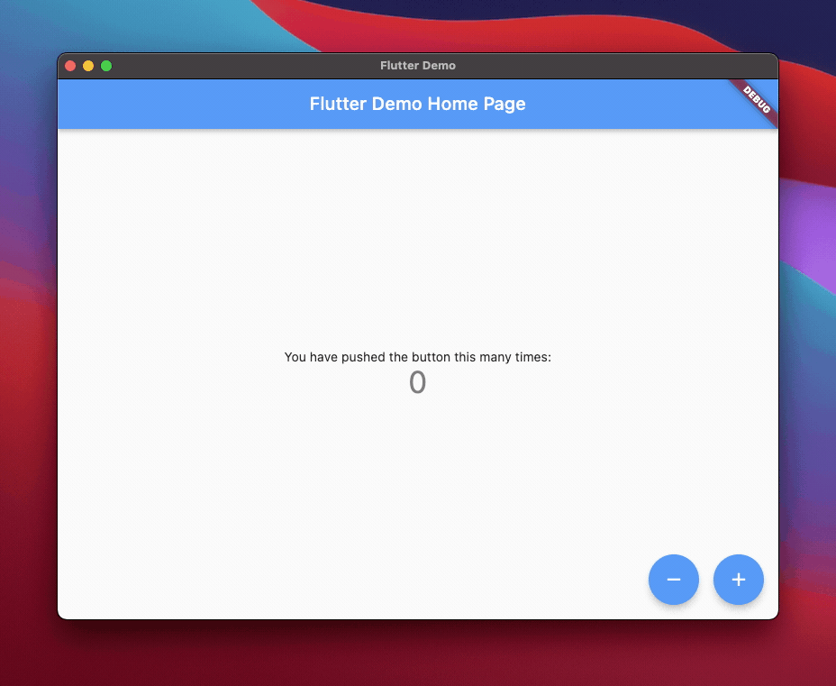

# Flutter Windows Demo Project (YAML build configuration)

A sample Flutter Windows Demo Project with `codemagic.yaml` configuration. For more details see the [Publishing Flutter Windows apps to Microsoft Partner Center with Codemagic](https://blog.codemagic.io/publishing-flutter-windows-apps/) blog post and the 
[Flutter apps quick start guide](https://docs.codemagic.io/yaml-quick-start/building-a-flutter-app/) documentation guide.



## Adding the app to Codemagic
The apps you have available on Codemagic are listed on the Applications page. Click **Add application** to add a new app.

1. If you have more than one team configured in Codemagic, select the team you wish to add the app to.
2. Connect the repository where the source code is hosted. Detailed instructions that cover some advanced options are available [here](https://docs.codemagic.io/getting-started/adding-apps/).
3. Select the repository from the list of available repositories. Select the appropriate project type.
4. Click **Finish: Add application**

## Creating codemagic.yaml
Codemagic uses a YAML configuration file to configure the CI/CD workflow. The name of the file must be `codemagic.yaml` and it must be located in the root directory of the repository. This sample project includes a `codemagic.yaml` file covering all of the steps outlined below. You can update the file with your own information and reuse it to build your own projects.

## Code signing

All applications have to be digitally signed before they are made available to the public to confirm their author and guarantee that the code has not been altered or corrupted since it was signed.

Normally, you would need to locally sign your app if you are going to publish it to the **Microsoft Store**. Since this is not possible when using cloud CI/CD, you need to create an **MSIX package** and publish through **Microsoft Partner Center**

1. Follow [this guide](https://docs.codemagic.io/knowledge-others/partner-center-authentication/) to setup **Microsoft Partner Center** authentication and create a new **Client secret**.
2. Open your Codemagic app settings, and go to the **Environment variables** tab.
3. Enter the desired **_Variable name_**, e.g. `CLIENT_SECRET`.
4. Enter the API key string as **_Variable value_**.
5. Enter the variable group name, e.g. **_windows_credentials_**. Click the button to create the group.
6. Make sure the **Secure** option is selected.
7. Click the **Add** button to add the variable.
8. Repeat the steps to also add `STORE_ID`, `TENANT_ID` and `CLIENT_ID` variables.
9. Add the **windows_credentials** variable group to the `codemagic.yaml`:
```yaml
  environment:
    groups:
      - windows_credentials
```

## Configure scripts to build the app
Add the following scripts to your `codemagic.yaml` file in order to prepare the build environment and start the actual build process.
In this step, you can also define the build artifacts you are interested in. These files will be available for download when the build finishes. For more information about artifacts, see [here](https://docs.codemagic.io/yaml-basic-configuration/yaml-getting-started/).

### Building an unpackaged Windows executable

```yaml
  scripts:
    - name: Get Flutter packages
      script: | 
          flutter packages pub get
    - name: Build Flutter Windows
      script: | 
        flutter config --enable-windows-desktop
        flutter build windows --release
        cd build/windows/runner/Release
        7z a -r ../release.zip ./*
    artifacts:
      - build/windows/runner/*.zip
```

### Creating an MSIX package for publishing to Microsoft Store
Codemagic uses the [Flutter msix package](https://pub.dev/packages/msix) for packaging the application. For publishing to the Microsoft Store, it is necessary to define certain arguments during packaging.

To pass these arguments to the packaging tool, either add the parameters to the packaging command in `codemagic.yaml` or add the package to your project and [configure](https://pub.dev/packages/msix#gear-configuration-optional) the arguments inside the `pubspec.yaml` file.

To generate MSIX, add the package under `dev_dependencies` in your `pubspec.yaml` file:
```yaml
  dev_dependencies:
    msix: ^2.6.5
```

Also add the following configuration at the end of the `pubspec.yaml` file:
```yaml
  msix_config:
    display_name: <AppName>
    publisher_display_name: <PublisherName>
    identity_name: <PublisherName.AppName>
    publisher: <PublisherID>
    msix_version: 1.0.0.0
    logo_path: ./logo/<file_name.png>
    store: true
```

The required values are:
 - `display_name`: The name of your app that will be displayed to users.
 - `publisher_display_name`: The name of the publisher to be displayed to users (can be an individual’s name or a company’s name).
 - `identity_name`: The unique identifier of the Windows app.
 - `publisher`: The Publisher ID present inside your Microsoft Partner Center app.
 - `msix_version`: Specifies the version of the app’s build. Uses the format “Major.Minor.Build.Revision”, where “Major” cannot be “0”.
 - `logo_path`: The relative path of the logo file (optional). If not provided, the default Flutter logo is used.
 - `store`: Setting this to true generates an MSIX package distributable using Microsoft Partner Center

When defining the arguments inside codemagic.yaml, the necessary flags to add to the `msix:create` command are `--store`, `--display-name`, `--publisher-display-name`, `--publisher` and `--version`.

The values for `--display-name`, `--publisher-display-name` and `--publisher` can be found when when logging into [Microsoft Partner Center](https://partner.microsoft.com/en-us/dashboard/home) and navigating to **Apps and games > Your application > Product Identity**.

The argument `--display-name` should be set to match the value of `Package/Identity/Name`, the argument `--publisher` should be set to match the value of `Package/Identity/Publisher` and the argument `--publisher-display-name` should be set to match the value of `Package/Properties/PublisherDisplayName`.

Check out how to version your package in the [Microsoft documentation](https://docs.microsoft.com/en-us/windows/uwp/publish/package-version-numbering). Note that per Microsoft Store requirements applications are not allowed to have a version with a revision number (last digit of the version) other than zero.

Add the following script after the **Build Flutter Windows** step:
```yaml
  scripts:
    - name: Build Flutter Windows
      # ....
    - name: Create package
      script: | 
        # if you did not add the msix pub package to your project:
        flutter pub add msix  
        #
        # if you have specified configuration in pubspec.yaml:
        flutter pub run msix:create
        #
        # if you did not modify `pubspec.yaml`:
        #flutter pub run msix:create --store \
        #  --publisher-display-name=MyName \
        #  --display-name=MyAppName \
        #  --publisher=CN=xx-yy-zz \
        #  --identity-name=com.flutter.MyApp \
        #  --version=1.0.2.0
    artifacts:
      - build/windows/**/*.msix
```

For all the possible flags for the `msix:create` command, check the [pub documentation](https://pub.dev/packages/msix#clipboard-available-configuration-fields). Note that when configuring the flags both in `codemagic.yaml` and `pubspec.yaml`, the ones configured in `codemagic.yaml` take precedence.


## Publishing
Codemagic offers a wide array of options for app publishing and the list of partners and integrations is continuously growing. For the most up-to-date information, check the guides in the **Configuration > Publishing** section of these docs.
To get more details on the publishing options presented in this guide, please check the [Email publishing](https://docs.codemagic.io/yaml-notification/email/) and the [Microsoft App Center](https://docs.codemagic.io/yaml-publishing/publish-app-artifacts-to-app-center/) publishing docs.

### Email publishing
If the build finishes successfully, release notes (if passed), and the generated artifacts will be published to the provided email address(es). If the build fails, an email with a link to build logs will be sent.

If you don’t want to receive an email notification on build success or failure, you can set `success` to `false` or `failure` to `false` accordingly.
``` yaml
workflows:
  sample-workflow-id:
    environment: 
      # ...
    scripts: 
      # ...
    publishing: 
      email:
        recipients:
          - user_1@example.com
          - user_2@example.com
        notify:
          success: true
          failure: false
```

### Publish to App Center
For publishing, Codemagic makes use of the [Microsoft Store submission API](https://docs.microsoft.com/en-us/windows/uwp/monetize/create-and-manage-submissions-using-windows-store-services). This requires linking your Partner Center account to the Azure AD application and providing Codemagic with information that can be used to generate temporary Azure AD access tokens for managing submissions.

> **Note:** The very first version of the app must be submitted to the Partner Center manually. You can download the **MSIX** package from the build artifacts.

```yaml
publishing:
  partner_center:
    store_id: $STORE_ID
    tenant_id: $TENANT_ID
    client_id: $CLIENT_ID
    client_secret: $CLIENT_SECRET
```

## Conclusion
Having followed all of the above steps, you now have a working `codemagic.yaml` file that allows you to build, code sign, automatically version, and publish your project using Codemagic CI/CD.
Save your work, commit the changes to the repository, open the app in the Codemagic UI and start the build to see it in action.


## Next steps
While this basic workflow configuration is incredibly useful, it is certainly not the end of the road and there are numerous advanced actions that Codemagic can help you with.

We encourage you to investigate [Running tests with Codemagic](https://docs.codemagic.io/yaml-testing/testing/) to get you started with testing, as well as additional guides such as the one on running tests on [Firebase Test Lab](https://docs.codemagic.io/yaml-testing/firebase-test-lab/) or [Registering iOS test devices](https://docs.codemagic.io/testing/ios-provisioning/).

Documentation on [using codemagic.yaml](https://docs.codemagic.io/yaml-basic-configuration/yaml-getting-started/) teaches you to configure additional options such as [changing the instance type](https://docs.codemagic.io/yaml-basic-configuration/yaml-getting-started/#instance-type) on which to build, speeding up builds by configuring [Caching options](https://docs.codemagic.io/yaml-basic-configuration/yaml-getting-started/#cache), or configuring builds to be [automatically triggered](https://docs.codemagic.io/yaml-basic-configuration/yaml-getting-started/#triggering) on repository events.